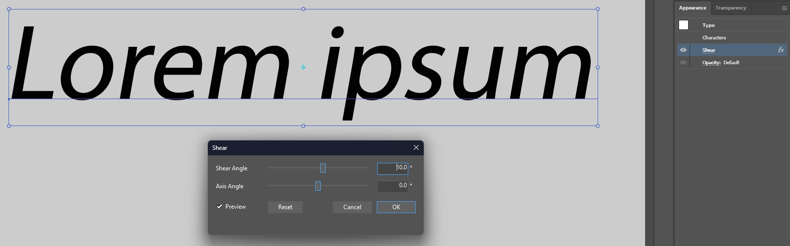

# LiveShear

A non-destructive **Shear** effect for Adobe Illustrator, at *Effect > Shear…*.

## Why

Illustrator can shear an object through *Object > Transform > Shear…*, but that rewrites the geometry in place. Its Appearance system has no equivalent: the built-in *Transform* effect offers move, scale, rotate, and reflect, and stops there. Shear is the one ordinary affine degree of freedom that never made it into the non-destructive stack.

This adds it. The artwork underneath is never touched — text stays live text, paths stay editable paths, and deleting the effect gives back exactly what you started with.

## Install

**Do not double-click *LiveShear.aip*.** It is a plugin, not a document; double-clicking it makes Illustrator try to *open* it as artwork and answer that the file format is unknown. Nothing is wrong with the file when that happens.

1. Quit Illustrator. It reads its plugin folders only at startup, and holds the *.aip* open while it runs.
2. Download *LiveShear-0.1.0-rc.6.zip* from the [latest release](../../releases/latest) and put *LiveShear.aip* in `%LOCALAPPDATA%\Adobe Illustrator Plug-ins\30`, creating that folder if it is not there. The *30* is Illustrator 2026's version number, and next year's Illustrator gets its own folder beside it.
3. Start Illustrator, open *Edit > Preferences > Plug-ins & Scratch Disks*, tick **Additional Plug-ins Folder**, choose that folder, and restart.

No administrator rights are needed for any of it, and `.\tools\sideload.ps1 -Path <folder>` sets the same preference from a script.

**Share that folder with your other Illustrator plugins.** Illustrator has one Additional Plug-ins Folder, not a list, so pointing it at a folder holding this plugin alone stops every other plugin you installed that way from loading.

`.\tools\install.ps1` installs into Illustrator's own *Plug-ins* folder under *Program Files* instead, asking for the administrator rights that folder needs. Use one or the other, [never both](KNOWN_LIMITATIONS.md#two-copies-installed-at-once-give-two-shear-commands). To uninstall, delete the *.aip*, or run `.\tools\install.ps1 -Uninstall`; nothing else is installed, and no services, registry entries, or startup items are involved.

## Use

Select some artwork and choose *Effect > Shear…*. The effect sits on the *Effect* menu itself, below Illustrator's own submenus, with the other third-party effects — Illustrator will not let a third-party effect join one of its own submenus, and [the investigation](LIVE_SHEAR_INVESTIGATION.md#where-the-menu-item-goes) has the measurements.

- **Shear Angle** is how far the artwork leans, in degrees, from −89° to 89°. Positive values lean the leading edge forward, the same direction Illustrator's own *Shear* command leans it.
- **Axis Angle** is the direction the shear runs along. At 0° the shear is horizontal, the familiar italic slant; at 90° it is vertical. An axis of φ and one of φ + 180° describe the same shear.
- **Preview** updates the artwork as you drag. *Cancel*, *Escape*, and the window's close button all put everything back exactly as it was; *OK* and *Enter* commit.
- The numeric fields take a decimal point or a decimal comma, ignore a degree sign, and respond to the up and down arrow keys — by ten degrees with *Shift* held. They work to a tenth of a degree, which is what the sliders carry and what the fields show.
- The window takes its colors from Illustrator, down to the title bar, so it matches whatever you have set under *Edit > Preferences > User Interface > Brightness*. Illustrator applies that setting when it starts, so the dialog that matches is one opened after a restart.

The artwork is sheared about the center of its **geometric** bounds, which is the reference point *Object > Transform > Shear* uses. The effect anchors on what the appearance stack hands it, so an *Offset Path* or a *Transform* below the Shear moves that center with it; put the Shear at the bottom of the *Appearance* panel to anchor on the bare geometry. [docs/BEHAVIOR.md](docs/BEHAVIOR.md) covers the two cases where Illustrator is not consistent about this, and how the stacking was checked against Illustrator's own shear.

**Sending a file to someone without the plugin** is safe: Illustrator warns, opens the document, and still draws the artwork sheared, with the source geometry and live text intact. What stops is the effect, so an edit made there renders against the old shape until the plugin is back. That is Illustrator's behavior for [any missing effect](KNOWN_LIMITATIONS.md#documents-opened-without-the-plugin-keep-drawing-but-stop-updating).

## Requirements

**Illustrator 2026**, 64-bit, on Windows. Everything claimed here was measured against Illustrator 30.7.0 on Windows 11 build 10.0.26200 — that one configuration. Windows 10 is expected to work and has not been run.

Given its own folder and its own preference under Illustrator 2025, this build did not load, so assume each Illustrator generation needs a build made for it. No Visual C++ redistributable is needed: the three runtime files the plugin uses are the ones *Illustrator.exe* names itself.

## Limits

Windows only; the shear angle stops at ±89°; the reference point is always the center; brushed artwork cannot match the destructive command, and no live effect can; display scaling above 100% and GPU preview are untested because no machine here could run them.

[KNOWN_LIMITATIONS.md](KNOWN_LIMITATIONS.md) has the full list, with what each one is and whether there is a way around it. [docs/SUPPORT_MATRIX.md](docs/SUPPORT_MATRIX.md) says which kinds of artwork are verified, which are untested, and which are not supported.

## Documentation

Every claim above comes from a probe that drives a real Illustrator over COM; there is no mock. The current run is **315 checks, none failed**, against the exact binary in the release.

- [docs/BEHAVIOR.md](docs/BEHAVIOR.md) — where the shear anchors, and how it stacks
- [docs/RELEASE_TEST_MATRIX.md](docs/RELEASE_TEST_MATRIX.md) — every check and its result, generated from the raw output
- [docs/RELEASE_READINESS.md](docs/RELEASE_READINESS.md) — the release assessment, with evidence
- [docs/evidence/](docs/evidence/) — what each probe actually printed
- [docs/BUILDING.md](docs/BUILDING.md) — toolchain, SDK, how to run the suite, and the scripting bridge
- [LIVE_SHEAR_INVESTIGATION.md](LIVE_SHEAR_INVESTIGATION.md) — why this is a standalone effect rather than an extension of Adobe's *Transform*, and what was ruled out on the way

## License

**GPL-3.0-or-later**, with an **Adobe Illustrator SDK linking exception** ([LICENSE](LICENSE), [LICENSE-EXCEPTION](LICENSE-EXCEPTION)). The exception is load-bearing rather than boilerplate, and LICENSE-EXCEPTION says why. It comes with **no warranty**; the [documentation](#documentation) and the [known limitations](KNOWN_LIMITATIONS.md) are what is offered instead of a promise.

Not affiliated with, endorsed by, or connected to Adobe. *Adobe*, *Illustrator*, and *Adobe Illustrator* are trademarks of Adobe Inc.

Vibecoded by [Vixen420](https://github.com/VulpesNexus) in September 2026. Copyright © 2026 Vixen420.
