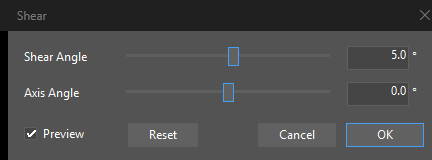

# LiveShear

A non-destructive **Shear** effect for Adobe Illustrator, at *Effect > Distort & Transform > Shear…*.

<p align="center"></p>

## Why

Illustrator can shear an object through *Object > Transform > Shear…*, but that rewrites the geometry in place. Its Appearance system has no equivalent: the built-in *Transform* effect offers move, scale, rotate, and reflect, and stops there. Shear is the one ordinary affine degree of freedom that never made it into the non-destructive stack.

This adds it. The artwork underneath is never touched — text stays live text, paths stay editable paths, and deleting the effect gives back exactly what you started with.

## Install

Quit Illustrator first. It reads its plugin folders only at startup, and holds the *.aip* open while it runs, so a file in use cannot be replaced.

Download *LiveShear-0.1.0-rc.3.zip* from the [latest release](../../releases/latest) and put *LiveShear.aip* in

```
%LOCALAPPDATA%\Adobe Illustrator Plug-ins\30
```

Then start Illustrator, open *Edit > Preferences > Plug-ins & Scratch Disks*, tick **Additional Plug-ins Folder**, choose that folder, and restart. No administrator rights are needed for any of it. `.\tools\sideload.ps1 -Path <folder>` sets the same preference from a script.

The *30* is Illustrator 2026's version number. Next year's Illustrator gets its own folder beside it, because a plugin built for one year is not guaranteed to load in another — see [Host versions](#host-versions).

**Share that folder with your other Illustrator plugins.** Illustrator has one Additional Plug-ins Folder, not a list, so pointing it at a folder holding this plugin alone stops every other plugin you installed that way from loading. Everything in the one folder loads.

There is a second place Illustrator looks — its own *Plug-ins* folder under *Program Files* — and `.\tools\install.ps1` will copy the file there, asking for the administrator rights that folder needs. Use one or the other, never both: under the same file name Illustrator says so and then ignores the whole additional folder, and under different names it loads both copies and the *Effect* menu gets two *Shear…* entries.

To uninstall, delete the *.aip*, or run `.\tools\install.ps1 -Uninstall`. Nothing else is installed: no services, no registry entries, no startup items. The plugin writes a trace file only when the `LIVESHEAR_LOG` environment variable names one, which it does not by default.

## Use

Select some artwork and choose *Effect > Distort & Transform > Shear…*.

- **Shear Angle** is how far the artwork leans, in degrees, from −89° to 89°. Positive values lean the leading edge forward, the same direction Illustrator's own *Shear* command leans it.
- **Axis Angle** is the direction the shear runs along. At 0° the shear is horizontal, the familiar italic slant; at 90° it is vertical. An axis of φ and one of φ + 180° describe the same shear.
- **Preview** updates the artwork as you drag. *Cancel*, *Escape*, and the window's close button all put everything back exactly as it was; *OK* and *Enter* commit.
- The numeric fields take a decimal point or a decimal comma, ignore a degree sign, and respond to the up and down arrow keys — by ten degrees with *Shift* held. They work to a tenth of a degree, which is what the sliders carry and what the fields show.
- The window takes its colors from Illustrator, down to the title bar, so it matches whatever you have set under *Edit > Preferences > User Interface > Brightness*. Illustrator applies that setting when it starts, so the dialog that matches is one opened after a restart.

## Where it shears about, and how it stacks

The artwork is sheared about the center of its **geometric** bounds — the Bézier outline, with strokes, effects, and the glyphs of area text left out. That is the same reference point *Object > Transform > Shear* uses, and it is measured rather than assumed: for each kind of artwork the suite can build, the effect and the native command are given the same angle, and the difference between the two results is solved back into the distance between their reference points. That distance is zero for paths, compound paths, plain, nested, clipped, and transformed groups, point and area text, symbol instances, and embedded rasters.

Two of those are worth saying out loud, because Illustrator is not consistent about them:

- A **clipping group** anchors on its clip path, not on everything inside it — even though the geometric bounds Illustrator *reports* for such a group are the union of its children.
- **Area text** anchors on its frame, not on its glyphs, so a line whose ascenders overshoot the frame does not move the center.

The effect anchors on what the appearance pipeline hands it, not on the original object, and that is what makes it compose. An *Offset Path* or a *Transform* below the Shear grows or moves the artwork, and the shear's reference point moves with it — exactly as stacking two transforms should. So the result depends on where in the *Appearance* panel the Shear sits, which is the point of having a stack. Put the Shear at the bottom to anchor on the bare geometry.

That composition is checked in both directions rather than asserted: a *Transform* above a Shear renders what the same *Transform* renders above Illustrator's own shear, and a Shear above a *Transform* renders what Illustrator's own shear renders on that *Transform* expanded into real geometry. Two Shear effects on one object render as two successive native shears, and reordering, swapping, or deleting them behaves the way two transforms should.

## Documents made with the effect, opened without it

Illustrator shows its standard missing-plugin warning, naming *Shear (LiveShear.aip)*, and then opens the document. The artwork still draws sheared, from the rendered result cached in the file. The source geometry is not expanded, not flattened, and not lost; text is still live text. What stops is the effect itself: editing the artwork will not re-shear it, so an edit made without the plugin renders against the old shape. Saving from that state loses nothing — put the plugin back and everything is live again.

This is Illustrator's standard behavior for any missing effect, not something particular to this one, but it is worth knowing before sending a file to someone who does not have the plugin.

## Limits

The full list, with what each one is and whether there is a way around it, is in [KNOWN_LIMITATIONS.md](KNOWN_LIMITATIONS.md). [docs/SUPPORT_MATRIX.md](docs/SUPPORT_MATRIX.md) says which kinds of artwork are verified, which are untested, and which are not supported.

The short version: Windows only; the shear angle stops at ±89°; the reference point is always the center; brushed artwork cannot match the destructive command, and no live effect can; display scaling above 100% and GPU preview are untested because no machine here could run them.

## Host versions

Everything claimed here was measured against Illustrator 30.7.0 on Windows 11 build 10.0.26200 — that one configuration.

This build is for **Illustrator 2026**. It was given its own folder and its own preference under Illustrator 2025, and Illustrator 2025 did not load it, so this is not a case of "probably fine on nearby versions." Whether a 2026 build will load in Illustrator 2027 is a different question and an open one: that version does not exist yet, so it cannot be tried. Assume each Illustrator needs a build made for it.

Windows 10 is expected to work and has not been run. The plugin needs no Visual C++ redistributable: the three runtime files it uses are the ones *Illustrator.exe* names itself, so a machine that can start Illustrator already has them.

## Verifying

Every claim above comes from a probe that drives a real Illustrator over COM; there is no mock. The current run is **302 checks, none failed**, against the exact binary in the release — built, hashed, installed, tested, and packed in that order, because the compiler stamps a link timestamp and a rebuild is a different file.

- [docs/RELEASE_TEST_MATRIX.md](docs/RELEASE_TEST_MATRIX.md) — every check and its result, generated from the raw output
- [docs/RELEASE_READINESS.md](docs/RELEASE_READINESS.md) — the release assessment, with evidence
- [docs/evidence/](docs/evidence/) — what each probe actually printed
- [docs/BUILDING.md](docs/BUILDING.md) — toolchain, SDK, how to run the suite, and the scripting bridge
- [LIVE_SHEAR_INVESTIGATION.md](LIVE_SHEAR_INVESTIGATION.md) — why this is a standalone effect rather than an extension of Adobe's *Transform*, and what was ruled out on the way

Where a probe and the documentation disagreed, the documentation was changed. Several claims in earlier drafts did not survive being tested, and the investigation notes leave the corrections visible rather than tidying them away.

## License

**GPL-3.0-or-later**, with an **Adobe Illustrator SDK linking exception** ([LICENSE](LICENSE), [LICENSE-EXCEPTION](LICENSE-EXCEPTION)).

The exception is load-bearing, not boilerplate: a release build compiles seven of its fifteen object files from Adobe's sample framework, under terms GPL section 10 forbids passing on. The repository itself vendors no Adobe code — the SDK is referenced by path — and the test harness in *tools/* links nothing.

It comes with **no warranty**, and the [verification](#verifying) and the [known limitations](KNOWN_LIMITATIONS.md) are what is offered instead of a promise.

Not affiliated with, endorsed by, or connected to Adobe. *Adobe*, *Illustrator*, and *Adobe Illustrator* are trademarks of Adobe Inc.

Vibecoded by [Vixen420](https://github.com/VulpesNexus) in September 2026. Copyright © 2026 Vixen420.
